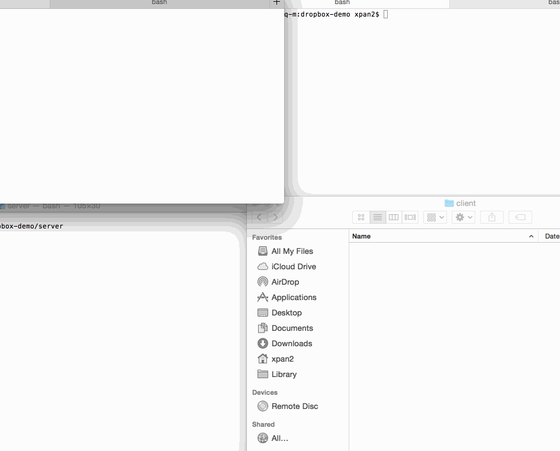

## dropbox-demo
This is the assignment one for the Node JS boot camp. In the project, I built a HTTP server using express, a TCP server
and TCP client using json-socket. This is a basic Dropbox clone to sync files across multiple remote folders.

### Features

#### Required

- [x] Client can make GET requests to get file or directory contents
- [x] Client can download a directory as an archive
- [x] Client can make HEAD request to get just the GET headers
- [x] Client can make PUT requests to create new directories and files with content
- [x] Client can make POST requests to update the contents of a file
- [x] Client can make DELETE requests to delete files and folders
- [x] Server will serve from `--dir` or cwd as root
- [x] Server will sync `HTTP` modifications over TCP to the Client
- [x] Server will sync watched file modifications (e.g., `fs.watch`) over TCP to the Client

### Walkthrough




## Starting the Server

```bash
npm start
```

## Starting the Client

```bash
npm run client
```
